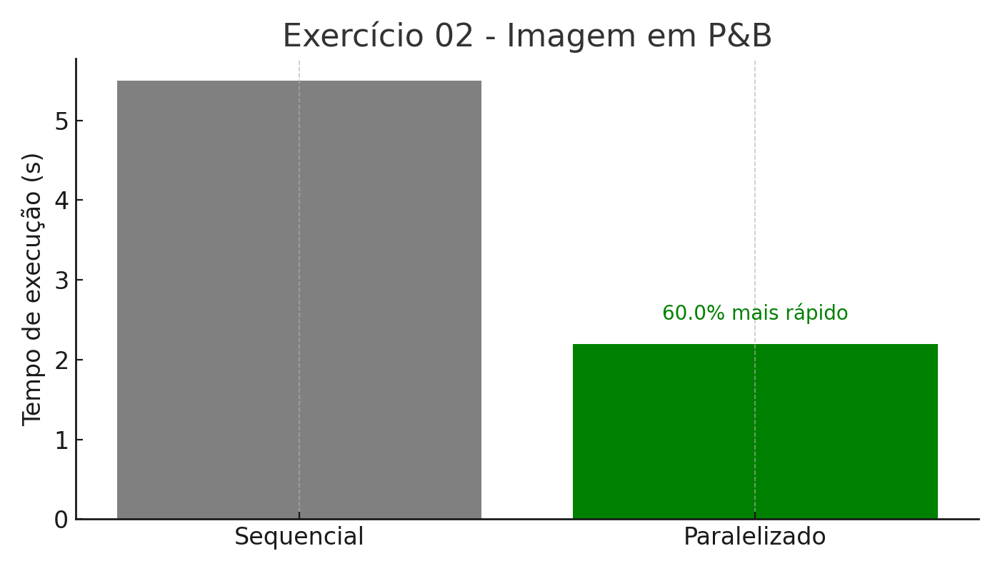

# image-grayscale-threads
Convertendo imagens coloridas para preto e branco com threads

**Arquivo:**
- `Exercico03.py`
- `exerc03.py`
- `da0c63704640dc65fce9f59db0c92185.png`
- `imagem_pb.jpg`

**Como usar no Google Colab:**
1. Faça upload da imagem desejada no Colab.
2. Faça upload do arquivo `da0c63704640dc65fce9f59db0c92185.png`.
3. Rode o script normalmente `exerc03.py`.
4. A imagem será convertida em tons de cinza com threads e salva como `imagem_pb.jpg`.
5. Use `files.download("/content/imagem_pb.jpg")` para baixar a imagem gerada.

